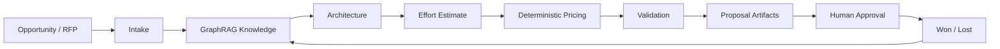
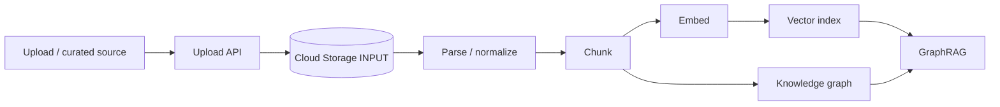
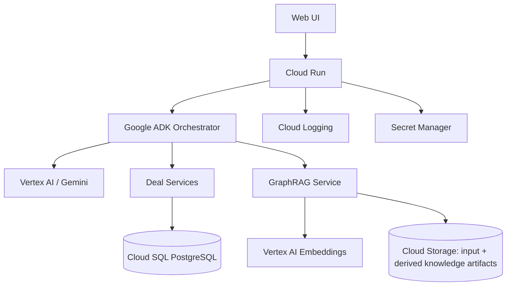
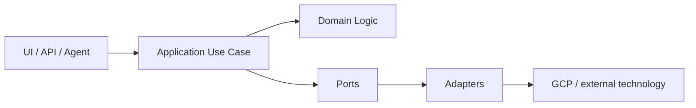

# Solution Deal Agent

> Agentic Deal Intelligence Platform for turning opportunities, RFPs, requirements and reusable enterprise knowledge into traceable technical solutions, effort estimates, deterministic commercial outputs and proposal artifacts.

## Product vision

Solution Deal Agent is a conversational agentic platform for the pre-sales and solution-design lifecycle. It augments Sales, Pre-sales, Architects, Pricing and Review teams with reusable governed knowledge, GraphRAG retrieval, structured reasoning, deterministic commercial calculations and explicit human approval.



## North Star

> **Reduce the median time from qualified opportunity to a validated proposal-ready package while preserving traceability, commercial consistency and human accountability.**

Quality guardrails:

- critical claims backed by evidence;
- architecture decisions linked to requirements/policies/precedents;
- transparent estimation basis;
- deterministic pricing;
- cross-artifact consistency;
- human approval;
- retrieval groundedness.

## Core experience

A deal can start in two ways:

1. **Conversation:** the user describes the opportunity and the Intake Agent progressively constructs the Deal Spec.
2. **RFP/RFI:** the user uploads a file; the platform first persists it in the controlled **Google Cloud Storage input zone** and only then starts parsing, chunking and knowledge processing.

> **When an RFP exists, the RFP initiates the Deal Spec. When no RFP exists, the conversation builds it.**

## Mandatory ingestion rule



**Chunking never receives a browser/local file directly. Its source is always a versioned object in the configured GCS input zone.**

## Agentic operating model

- **Deal Orchestrator** — owns conversation and deal lifecycle coordination.
- **Intake / RFP Agent** — extracts and structures requirements, gaps and clarifications.
- **Knowledge / GraphRAG Agent** — retrieves architecture knowledge and comparable precedents.
- **Architect Agent** — proposes traceable architecture decisions and asks for missing critical information.
- **Effort Estimator Agent** — produces WBS, roles, FTE/hours, dependencies and estimate rationale.
- **Pricing Capability** — deterministic calculation from structured effort and commercial rules.
- **Validator Agent** — independently checks completeness, evidence and consistency.
- **Artifact Agent** — generates technical/economic proposal outputs from an approved Deal Spec.

## Deal Spec — single source of truth

```text
Deal
├── Opportunity / Client Context
├── Source Documents
├── Requirements / Clarifications
├── Scope / Assumptions / Exclusions
├── Architecture / ADRs / Components
├── Evidence / Precedents
├── WBS / Roles / FTE / Effort
├── Cost / Price / Margin
├── Risks / Deliverables
├── Validation Findings
├── Artifacts
└── Approvals
```

All generated outputs are views of a specific Deal Spec version.

## Knowledge architecture

The first construction baseline uses **GraphRAG** across three governed knowledge domains:

| Domain | Examples | Purpose |
|---|---|---|
| Architecture | policies, patterns, standards, reference architectures | guide solution decisions |
| Precedents | historical proposals, WBS, estimates, lessons learned | support comparison and estimation |
| Opportunity | current RFP and supporting client material | current-deal grounding |

The ingestion pipeline performs:

**GCS input → normalization → semantic/structural chunking → embeddings/vector index → entity/relationship extraction → knowledge graph → hybrid GraphRAG retrieval.**

For FAST DEMO, vector-index and graph artifacts are persisted in GCS through replaceable adapters. This is a demo storage decision, not a claim that object storage is the final production vector/graph database.

## GCP construction baseline



Initial platform components:

- Cloud Run;
- Google ADK;
- Vertex AI / Gemini;
- Vertex AI Embeddings;
- Cloud Storage input and derived artifact zones;
- Cloud SQL PostgreSQL for structured Deal Spec state;
- Cloud Logging;
- Secret Manager;
- Artifact Registry + Cloud Build as construction/deployment matures.

## Software architecture

The project follows **PA-SDD / DevPattern** and adopts **Hexagonal Slice Architecture** because the product has meaningful business rules and replaceable dependencies such as LLM, parser, embeddings, vector store, graph store, pricing rules and persistence.



The agent acts as orchestrator/driving adapter. Critical rules such as pricing, proposal-readiness gates and lifecycle transitions remain explicit application/domain behavior.

## Product principles

1. **Do not invent — ask.**
2. **Do not decide without evidence — reference.**
3. **GCS input before chunking.**
4. **Reuse before rebuilding.**
5. **Graph + semantic retrieval for knowledge grounding.**
6. **Separate reasoning from deterministic calculation.**
7. **One Deal Spec, many artifacts.**
8. **Human accountability remains explicit.**
9. **Every Won/Lost result can enrich future decisions.**
10. **Architecture rigor grows with risk and maturity.**

## FAST DEMO success definition

A successful Golden Deal demonstrates end-to-end:

1. upload RFP to controlled GCS input;
2. parse and chunk with provenance;
3. create vector and graph knowledge artifacts;
4. extract traceable requirements and clarification questions;
5. retrieve architecture policies and precedents using GraphRAG;
6. produce traceable architecture decisions;
7. generate WBS/effort estimate;
8. calculate deterministic cost/price/margin;
9. detect seeded inconsistencies with Validator;
10. obtain explicit human approval;
11. generate technical proposal and pricing summary from the same Deal Spec version.

## Repository index

- [`docs/SPEC.md`](docs/SPEC.md) — SPEC-001: user stories, FR/NFR, business rules, acceptance criteria and eval baseline.
- [`docs/ARCHITECTURE.md`](docs/ARCHITECTURE.md) — GCP, GraphRAG, ingestion, chunking and Hexagonal Slice architecture.
- [`docs/AGENT_CONTRACTS.md`](docs/AGENT_CONTRACTS.md) — agent/tool behavioral boundaries.
- [`docs/ROADMAP.md`](docs/ROADMAP.md) — progressive FAST DEMO → MVP → PRODUCT evolution.
- [`docs/CONSTRUCTION_READINESS.md`](docs/CONSTRUCTION_READINESS.md) — prerequisites and first implementation slices.

## Current status

**SPEC-001 construction baseline being finalized.**

The next gate is not “write all agents”. It is to prove the foundational knowledge chain:

```text
GCS INPUT
→ Parse / Normalize
→ Chunk
→ Embed
→ Vector Index
→ Graph Extraction
→ GraphRAG Retrieval
→ Traceable Agent Output
```
