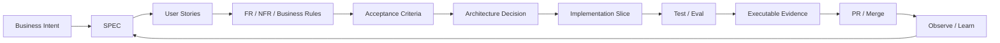
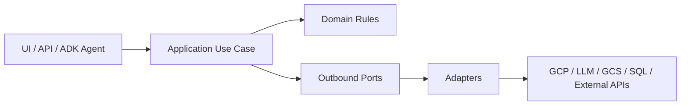
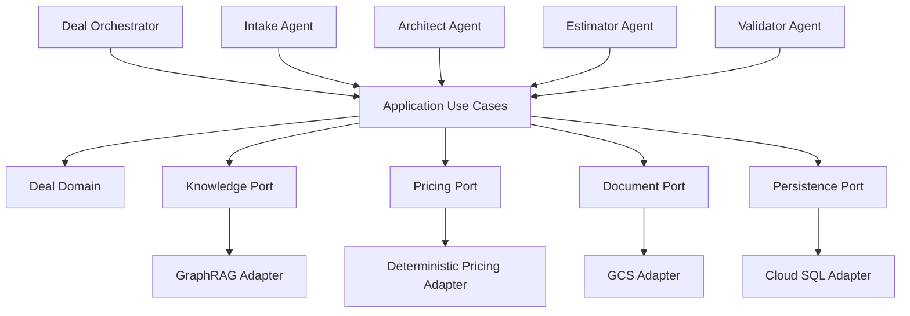
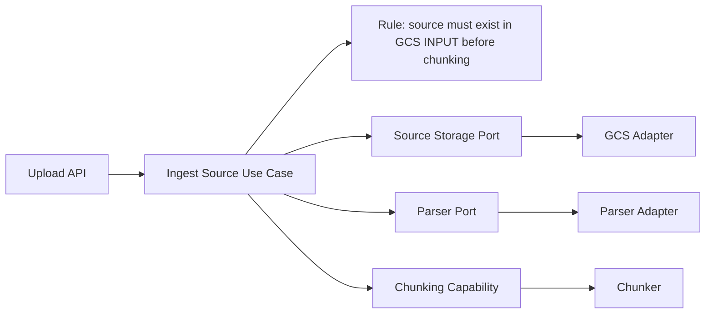
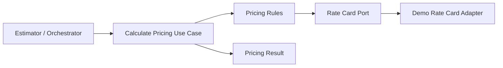

# ADR-001 — Spec-Driven Development + Hexagonal Slice Architecture

Status: ACCEPTED  
Project: Solution Deal Agent  
Applies from: FAST DEMO onward

## Context

Solution Deal Agent will be developed as an agentic software product with multiple logical specialist agents, explicit business rules, GraphRAG knowledge retrieval, deterministic pricing, document ingestion, generated artifacts and human approval gates.

The product must evolve quickly for the FAST DEMO while preserving enough engineering discipline to avoid business logic being buried in prompts or coupled directly to cloud/vendor SDKs.

## Decision

The project will use two mandatory engineering principles:

1. **Spec-Driven Development (SDD)** following the PA-SDD pattern from `JuliusCordova/DevPattern`.
2. **Hexagonal Slice Architecture** as the software architecture baseline.

## 1. SDD operating model

Implementation starts from an explicit specification and acceptance criteria before code is promoted.



### Required traceability

Where practical, implementation must preserve:

```text
Business Objective
  ↓
User Story
  ↓
Functional / Non-functional Requirement
  ↓
Business Rule
  ↓
Acceptance Criterion
  ↓
Implementation Slice
  ↓
Test / Eval
  ↓
Evidence
```

### FAST DEMO rule

SDD does not mean document-heavy delivery. The 10-day demo uses the minimum sufficient specification already defined in the repository and only adds artifacts that reduce ambiguity, risk or rework.

## 2. Hexagonal Slice Architecture

The software will be organized around business capabilities / vertical slices, while external dependencies are isolated behind ports and adapters when that boundary adds concrete value.



### Agentic interpretation

Agents are orchestrators / driving adapters. They do not become the authoritative home for critical business logic.



## 3. Initial vertical slices

The FAST DEMO should be implemented feature-first rather than by horizontal technical layer.

```text
features/
├── ingestion/
├── knowledge/
├── deal_intake/
├── architecture_design/
├── estimation/
├── pricing/
├── validation/
├── approval/
└── artifact_generation/
```

Each feature owns the smallest practical set of:

- application use cases;
- domain rules;
- agent behavior for the slice;
- tools;
- adapters where needed;
- tests;
- evals;
- evidence.

## 4. Dependency rules

1. Domain rules must not depend on Google SDKs, Gemini/Vertex AI, Cloud Storage, Cloud SQL or ADK.
2. Application logic must not call vendor SDKs directly when an explicit port materially improves testability or replaceability.
3. Agents may orchestrate use cases but must not hide deterministic business rules in prompts.
4. Pricing is deterministic domain/application behavior exposed to agents as a tool.
5. Deal lifecycle transitions and approval gates are explicit business rules.
6. GraphRAG is an infrastructure capability behind a knowledge retrieval contract.
7. GCS is an adapter; the domain only needs a source-document / object-storage contract.
8. LLM and embedding providers remain replaceable infrastructure dependencies.
9. Prompts, agent instructions and eval datasets are versioned engineering assets.
10. Each vertical slice owns its relevant unit tests, integration tests and agent evals.

## 5. Example — ingestion slice



The critical rule `GCS INPUT before chunking` belongs to application/domain behavior, not to a prompt.

## 6. Example — pricing slice



Gemini may explain the result, but cannot alter the authoritative deterministic calculation.

## 7. Progressive architecture

### FAST DEMO

Keep boundaries lightweight. A slice may initially contain:

```text
feature/
├── application.py
├── domain.py
├── agent.py
├── tools.py
├── adapters.py
└── tests/
```

Do not create interfaces mechanically.

### MVP

Introduce explicit ports/adapters where integration, testing, security or vendor volatility justify them.

```text
feature/
├── application/
├── domain/
├── ports/
├── adapters/
├── agent/
└── evals/
```

### PRODUCT

Strengthen boundaries based on proven scale, security, operational and ownership needs.

## 8. Implementation rule for the 10-day plan

Every day/slice in `docs/IMPLEMENTATION_PLAN_10_DAYS.md` must satisfy:

> SPEC/acceptance first → implement vertical slice → test/eval → capture evidence → merge.

The 40-hour cap remains unchanged. Architectural ceremony must stay proportional to the FAST DEMO.

## 9. Consequences

### Positive

- clear traceability from business intent to code/evidence;
- reduced prompt-only business logic;
- replaceable GCP/LLM/storage implementations;
- easier testing of deterministic behavior;
- localized changes by business capability;
- cleaner evolution from demo to MVP/product.

### Trade-offs

- slightly more design discipline than a single monolithic script;
- teams must distinguish agent reasoning from application/domain rules;
- poorly justified ports/interfaces are explicitly discouraged to avoid overengineering.

## 10. Acceptance of this ADR

All new implementation work for Solution Deal Agent must treat **SDD + Hexagonal Slice Architecture** as the default engineering baseline unless a later ADR explicitly supersedes this decision.
