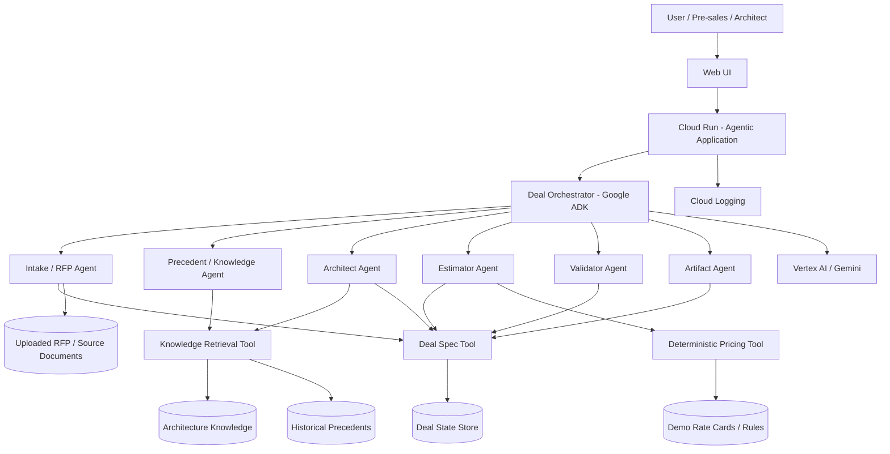

# Architecture — Solution Deal Agent FAST DEMO

Status: DRAFT  
Target cloud: Google Cloud Platform  
Architecture mode: FAST DEMO / PA-SDD

## 1. Architecture objective

Prove the end-to-end agentic deal flow on GCP using the simplest viable runtime while preserving clear contracts, traceability and deterministic boundaries.

The FAST DEMO deliberately avoids distributed agent infrastructure unless required to prove the use case.

## 2. Architecture principles

1. Cloud Run remains the default runtime.
2. Google ADK coordinates the conversational orchestrator and logical specialist agents.
3. Vertex AI / Gemini provides language and reasoning capabilities.
4. Durable business state is stored explicitly; conversation memory is not the authoritative deal record.
5. Knowledge retrieval and deterministic calculations are exposed through explicit tools.
6. Pricing calculations are deterministic.
7. Architecture knowledge and historical proposal evidence remain logically separated.
8. Human approval is explicit before proposal-ready state.
9. All material decisions should retain evidence references.
10. Multi-agent behavior may exist logically in one runtime for FAST DEMO.

## 3. Logical architecture



## 4. GCP FAST DEMO component baseline

### Cloud Run

Hosts the frontend/API and agent runtime as one deployable service initially, unless implementation evidence justifies separation.

### Google ADK

Defines:
- Deal Orchestrator;
- logical specialist agents;
- tool invocation;
- delegation rules;
- agent behavior contracts.

### Vertex AI / Gemini

Used for:
- requirement interpretation;
- clarification generation;
- architecture reasoning;
- semantic comparison;
- estimation reasoning;
- validation reasoning;
- artifact drafting.

### Document storage

A lightweight GCP-backed storage mechanism will hold uploaded RFP/source documents for the demo. Final selection should favor the simplest managed option that preserves source identity and retrievability.

### Knowledge retrieval

FAST DEMO needs two logically distinct evidence domains:

1. governed architecture knowledge;
2. historical proposal / precedent knowledge.

Retrieval can start with metadata + semantic/vector search. GraphRAG is explicitly deferred unless the demo exposes a relationship query that cannot be adequately handled by the simpler model.

### Deal state store

Stores the canonical Deal Spec and lifecycle state. The exact storage component is an implementation decision still open. The data model must support structured relationships and versioned deal state.

### Pricing tool

A deterministic function/tool receives structured effort plus configured commercial variables and returns a reproducible calculation.

### Logging / evidence

Cloud Logging captures basic runtime events. The application should additionally emit structured decision/evidence records where material.

## 5. Runtime boundary

For FAST DEMO:

```text
One Cloud Run application
      ↓
One ADK orchestration boundary
      ↓
Multiple logical specialist agents
      ↓
Explicit tools / knowledge stores
```

This preserves the business concept of specialist agents without paying the complexity cost of distributed runtimes too early.

## 6. Suggested first tool contracts

- `deal.create`
- `deal.get`
- `deal.update_section`
- `deal.add_requirement`
- `deal.add_assumption`
- `deal.add_architecture_decision`
- `deal.add_estimate`
- `deal.add_validation_finding`
- `knowledge.search_architecture`
- `knowledge.search_precedents`
- `document.get_source_fragment`
- `pricing.calculate`
- `artifact.generate`
- `approval.record`

## 7. Security boundary for demo

Minimum controls:

- dedicated runtime service account;
- least-privilege access to storage/state;
- Secret Manager for secrets if any are needed;
- no real confidential customer documents in baseline demo data;
- no hard-coded credentials;
- explicit approval before proposal-ready state;
- logging that avoids unnecessary sensitive document content.

## 8. Evolution to MVP

Add when justified:

- frontend/API separation;
- dedicated persistence tier;
- production document ingestion pipeline;
- stronger identity / SSO;
- separate service accounts by capability;
- richer observability and traces;
- eval datasets and automated regression gates;
- CI/CD with Cloud Build + Artifact Registry;
- enterprise APIs;
- stronger tool authorization;
- durable approval workflow;
- semantic metadata governance;
- selected multi-agent runtime separation where ownership/security/scale justifies it.

## 9. Evolution to PRODUCT

Potential future capabilities, only when evidence justifies them:

- private ingress / VPC connectivity / PSC;
- asynchronous workloads through Pub/Sub/Eventarc;
- Cloud Run Jobs for batch/evals;
- worker pools for continuous background workloads;
- enterprise CRM/pricing integration;
- knowledge graph / GraphRAG;
- AgentOps / FinOps;
- formal evidence packs;
- promotion/rollback gates;
- delivery actuals feedback loop;
- Won/Lost analytics;
- policy-aware runtime permissions;
- MCP and A2A interoperability where cross-platform integration creates clear value.

## 10. Key architectural decision

> The FAST DEMO will prove a multi-agent business experience while keeping the deployment architecture intentionally simple: one orchestrated ADK application on Cloud Run, explicit tools, structured Deal Spec, separated knowledge domains and deterministic pricing.
