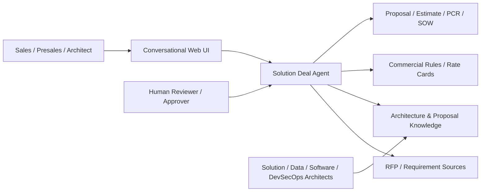
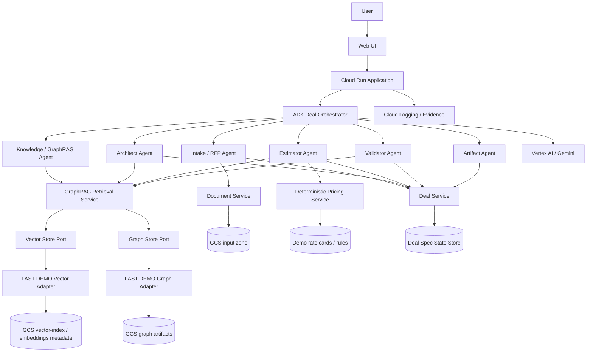
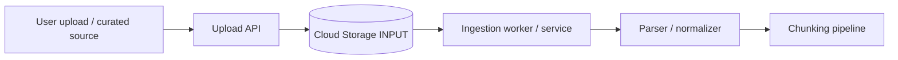
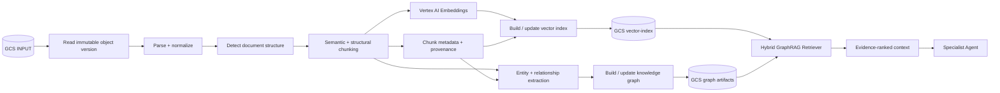
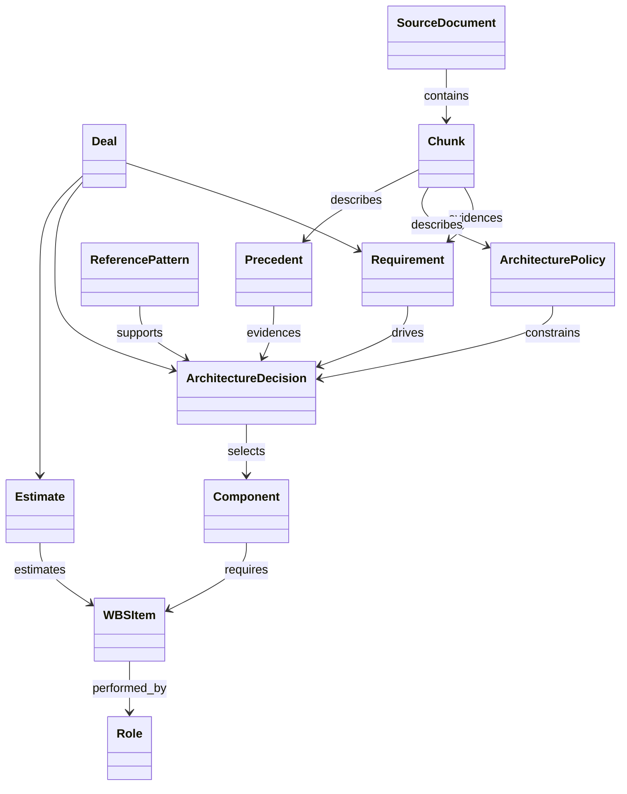
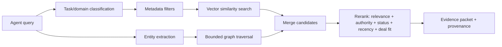
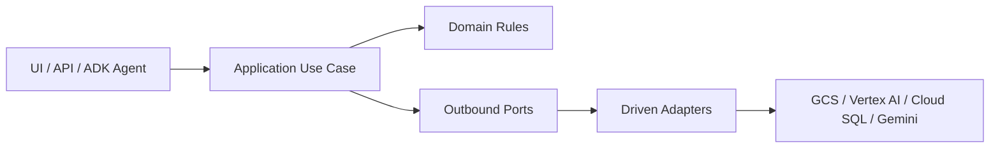
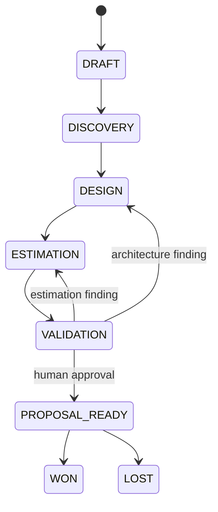
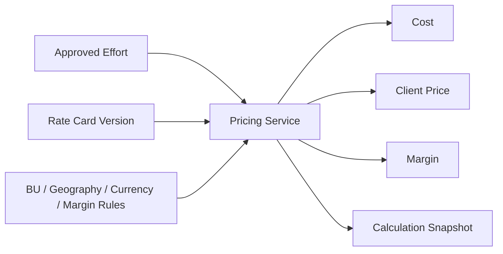

# Architecture — Solution Deal Agent

Status: BASELINE FOR CONSTRUCTION  
Mode: FAST DEMO with evolution path to MVP/PRODUCT  
Target cloud: Google Cloud Platform  
Method: PA-SDD / DevPattern

## 1. Architectural intent

Solution Deal Agent is an agentic pre-sales platform that converts an opportunity, conversation or RFP into a traceable Deal Spec, technical solution, effort estimate, deterministic commercial calculation and proposal artifact.

The FAST DEMO must prove the business behavior with the fewest operational moving parts while preserving replaceable integration boundaries. Following DevPattern, the implementation uses feature-oriented slices and introduces ports/adapters where external dependencies, business rules, testing, security or future replacement justify them.

The solution uses **GraphRAG from the first construction baseline**.

> **Mandatory ingestion rule:** the input to the chunking pipeline is always an object already stored in a controlled Google Cloud Storage input zone. Chunking never reads directly from a browser upload, local file path or arbitrary external URL.

The browser/API may receive a document, but the first durable action is to store it in the GCS input zone. Only then can ingestion, parsing, normalization and chunking begin.

## 2. Architecture principles

1. One canonical **Deal Spec** is authoritative business state.
2. Agents orchestrate capabilities; critical business rules do not live only in prompts.
3. GraphRAG combines semantic retrieval with relationship traversal.
4. Source provenance is mandatory for material recommendations.
5. **GCS input is the sole entry point to the chunking pipeline.**
6. Chunking is explicit, versioned, reproducible and testable.
7. Pricing is deterministic and isolated from LLM arithmetic.
8. Human approval is required before `PROPOSAL_READY`.
9. External technologies remain adapters behind explicit ports when isolation adds value.
10. Cloud Run + Google ADK + Vertex AI/Gemini are the default runtime baseline.
11. Every generated artifact derives from an approved Deal Spec version.
12. Graph and vector persistence may evolve without changing core domain behavior.

## 3. Context architecture



## 4. End-to-end logical architecture



## 5. Mandatory document ingestion contract

All knowledge sources, RFPs and supporting documents follow the same controlled entry contract.



### Rule

`GCS INPUT -> parse/normalize -> chunk`

Not allowed:

`browser/local file -> chunk`

The GCS object URI and generation/version become part of the ingestion evidence.

## 6. GraphRAG ingestion pipeline

Knowledge namespaces:

- `architecture`: policies, standards, reference architectures, design/development patterns;
- `precedents`: historical technical/economic proposals, WBS, assumptions, lessons learned;
- `opportunity`: current RFP and supporting client material.



### 6.1 Chunking strategy

Chunking is not a fixed split-by-character operation. The baseline uses **structure-aware semantic chunking**:

1. read source only from the GCS input object/version;
2. normalize text while preserving locators;
3. detect title, section, subsection, table, list and paragraph boundaries;
4. preserve RFP requirement IDs, policy IDs and architecture references;
5. create chunks by semantic unit;
6. enforce configurable max token size after structural segmentation;
7. apply limited overlap only when needed for continuity;
8. attach provenance metadata to each chunk;
9. calculate a content hash;
10. persist chunks before embedding/index generation.

Minimum chunk metadata:

```yaml
chunk_id: string
document_id: string
source_gcs_uri: gs://bucket/input/...
source_generation: string
knowledge_domain: architecture | precedent | opportunity
source_type: rfp | proposal | policy | pattern | reference_architecture | other
section_path: string
page_or_locator: string
text_hash: string
chunker_version: string
embedding_model: string
owner: string
status: approved | draft | historical
confidentiality: demo | internal | restricted
valid_from: date|null
valid_to: date|null
```

## 7. Initial knowledge graph model



Initial relationship types:

- `REQUIRES`
- `CONSTRAINS`
- `SUPPORTED_BY`
- `DERIVED_FROM`
- `SIMILAR_TO`
- `IMPLEMENTS`
- `USES_COMPONENT`
- `ESTIMATED_BY`
- `EVIDENCED_BY`
- `APPLIES_TO`

## 8. GraphRAG retrieval flow



The evidence packet must return source IDs, chunk IDs and relevant graph relationships, not only generated prose.

## 9. GCP component baseline

| Component | Purpose |
|---|---|
| Cloud Run | Web/API and ADK agent runtime |
| Google ADK | Orchestrator and logical specialist agents |
| Vertex AI / Gemini | Extraction, reasoning, drafting and validation |
| Vertex AI Embeddings | Embedding generation |
| Cloud Storage — input | Controlled entry point for all documents before ingestion/chunking |
| Cloud Storage — derived | Normalized text, chunks, embedding/index artifacts, graph artifacts, generated files, evidence |
| Cloud SQL PostgreSQL | Preferred structured persistence for Deal Spec, lifecycle, approvals and metadata requiring transactional consistency |
| Cloud Logging | Runtime and evidence logs |
| Secret Manager | Secrets and protected configuration |
| Artifact Registry | Container image repository |
| Cloud Build | Repeatable build/deployment |

### FAST DEMO storage decision

For the demo, vector index artifacts and graph artifacts are persisted in GCS and loaded through adapters at runtime. The interfaces intentionally allow migration later to a dedicated managed vector/graph technology without changing the knowledge use cases.

### Suggested GCS layout

```text
gs://solution-deal-agent-demo/
├── input/
│   ├── architecture/
│   ├── precedents/
│   └── opportunities/
├── normalized/
├── chunks/
├── embeddings/
├── vector-index/
│   ├── architecture/
│   ├── precedents/
│   └── opportunities/
├── graph/
│   ├── nodes.jsonl
│   ├── edges.jsonl
│   └── graph_manifest.json
├── generated-artifacts/
└── evidence/
```

## 10. Software architecture — Hexagonal Slice

The project adopts DevPattern's **Hexagonal Slice Architecture** because it has meaningful domain logic and multiple replaceable external dependencies: LLM, document parser, embeddings, vector store, graph store, persistence, commercial rules and artifact generators.



Recommended source structure:

```text
src/
├── features/
│   ├── intake/
│   ├── knowledge/
│   │   ├── application/
│   │   ├── graphrag/
│   │   ├── ports/
│   │   ├── adapters/
│   │   └── evals/
│   ├── architecture_design/
│   ├── estimation/
│   ├── pricing/
│   ├── validation/
│   ├── artifacts/
│   └── approvals/
├── shared/
│   ├── domain/
│   ├── contracts/
│   ├── observability/
│   └── config/
└── app/
    ├── api.py
    └── adk_runtime.py
```

Required ports:

- `DocumentStorePort`
- `DocumentParserPort`
- `ChunkRepositoryPort`
- `EmbeddingPort`
- `VectorStorePort`
- `GraphStorePort`
- `DealRepositoryPort`
- `LLMPort`
- `PricingRulesPort`
- `ArtifactStorePort`
- `ApprovalRepositoryPort`

## 11. Deal Spec lifecycle



Every mutation records deal ID, Deal Spec version, actor/agent, timestamp, changed fields, reason and evidence where applicable.

## 12. Deterministic pricing boundary



The LLM may explain or request missing data but must not produce the authoritative numeric result.

## 13. Security and governance baseline

- dedicated Cloud Run service account;
- least privilege IAM;
- controlled GCS input prefix/bucket;
- object version/provenance captured before processing;
- no secrets in source code;
- Secret Manager for secrets;
- document/chunk confidentiality metadata;
- logs avoid unnecessary raw sensitive content;
- human approval for proposal-ready state;
- provenance for material architecture/commercial decisions.

## 14. Observability and evidence

Capture at minimum:

- deal/correlation ID;
- source GCS URI + generation;
- ingestion/chunker version;
- agent and tool invoked;
- retrieval query;
- evidence IDs;
- graph relationships used;
- model and prompt/instruction version;
- latency;
- validation result;
- approval decision.

## 15. Construction rule

The first implementation must prove this chain before expanding scope:

```text
GCS INPUT
→ Parse / Normalize
→ Chunk
→ Embed
→ Build vector index
→ Extract graph
→ GraphRAG retrieval
→ Deal Spec / Agent reasoning
→ Traceable output
```

This pipeline is a prerequisite for the Architect Agent because its recommendations must be grounded in governed architecture knowledge and precedents.