# Construction Readiness — Solution Deal Agent

Status: BASELINE  
Applies to: FAST DEMO / SPEC-001

## 1. What is still needed before coding the full product

The product definition is sufficient to start implementation, but construction should begin in ordered slices rather than by coding every agent at once.

The critical dependency chain is:

```mermaid
flowchart LR
    A[Golden Deal + curated corpus] --> B[GCS input contract]
    B --> C[Parser / normalization]
    C --> D[Chunking + provenance]
    D --> E[Embeddings / vector retrieval]
    E --> F[Entity / relationship extraction]
    F --> G[GraphRAG retrieval]
    G --> H[Intake Agent]
    H --> I[Architect Agent]
    I --> J[Estimator]
    J --> K[Pricing]
    K --> L[Validator / Artifacts / Approval]
```



## 2. Inputs required from the product team

Before the Golden Deal end-to-end demo, prepare:

- one representative RFP/RFI fixture;
- 3–10 architecture policies/patterns/reference documents;
- at least 3 representative historical or synthetic proposal precedents;
- one demo role catalog;
- one demo rate card/business rule set;
- one technical proposal template;
- one pricing summary template;
- manually labeled expected requirements for the Golden Deal;
- expected architecture decisions/evidence for a small set of evaluation questions.

## 3. First vertical slices

### Slice 1 — Controlled knowledge ingestion

Goal: prove that every document is durable and traceable before AI processing.

Deliverables:

- upload API/UI;
- controlled `gs://.../input/` location;
- document metadata record;
- GCS URI + object generation capture;
- rejection of non-approved source locations.

Exit evidence:

- automated test for allowed/forbidden ingestion source;
- sample RFP stored in GCS;
- provenance record visible.

### Slice 2 — Parser + chunking

Goal: convert GCS input documents into traceable chunks.

Deliverables:

- `DocumentParserPort` + first adapter;
- structure-aware chunker;
- configurable max tokens/overlap;
- chunk metadata schema;
- chunk artifact persistence.

Exit evidence:

- every sample chunk resolves to source GCS object + locator;
- deterministic/reproducible processing test;
- tables/sections/requirement IDs tested on Golden Deal fixture.

### Slice 3 — Vector retrieval

Goal: prove semantic evidence retrieval independently of agents.

Deliverables:

- `EmbeddingPort`;
- Vertex AI embedding adapter;
- `VectorStorePort`;
- FAST DEMO GCS-backed index adapter;
- metadata filters by knowledge domain.

Exit evidence:

- Golden queries retrieve expected architecture/precedent chunks;
- retrieval metrics captured.

### Slice 4 — Knowledge graph + GraphRAG

Goal: prove relationship-aware retrieval.

Deliverables:

- entity/relationship extraction contract;
- graph schema;
- `GraphStorePort`;
- GCS graph adapter;
- hybrid merge/rerank service;
- evidence packet contract.

Exit evidence:

- at least one evaluation query requiring relationship traversal beats vector-only retrieval;
- returned answer packet exposes chunks and graph path.

### Slice 5 — Deal Spec + Intake

Goal: convert an RFP into structured opportunity state.

Deliverables:

- Deal repository;
- Deal Spec versioning;
- requirement extraction;
- known/unknown/assumed/derived states;
- clarification questions.

Exit evidence:

- Golden Deal requirements compared against manual labels.

### Slice 6 — Architect Agent

Goal: produce grounded, inspectable architecture decisions.

Deliverables:

- architecture analysis use case;
- requirements + policies + precedents evidence packet;
- ADR-like output;
- alternatives/trade-offs;
- critical-unknown stop behavior.

Exit evidence:

- material decisions reference requirements and governed evidence;
- seeded missing information produces a question, not hallucination.

### Slice 7 — Estimation + deterministic pricing

Goal: convert architecture to effort and economics.

Deliverables:

- WBS structure;
- role/hour estimation contract;
- pricing service;
- demo rate cards/rules;
- calculation snapshot.

Exit evidence:

- pricing regression is deterministic;
- material estimate lines show their basis.

### Slice 8 — Validator + artifact + approval

Goal: close the proposal-ready loop.

Deliverables:

- validation findings;
- proposal-ready gate;
- technical proposal artifact;
- pricing summary artifact;
- approval record.

Exit evidence:

- seeded inconsistency blocks readiness;
- approved artifacts share the same Deal Spec version.

## 4. Architecture decisions required now

The following are considered decided for FAST DEMO:

| Decision | Baseline |
|---|---|
| Runtime | Cloud Run |
| Agent framework | Google ADK |
| LLM | Vertex AI / Gemini |
| Embeddings | Vertex AI Embeddings |
| Raw ingestion entry | Google Cloud Storage INPUT |
| Chunk source | Only versioned objects from GCS INPUT |
| Vector/graph persistence for demo | GCS-backed artifacts via ports/adapters |
| Canonical deal state | Cloud SQL PostgreSQL preferred |
| Software architecture | Hexagonal Slice / feature-oriented |
| Knowledge pattern | GraphRAG |
| Pricing | Deterministic service/tool |
| Approval | Human-in-the-loop |

## 5. Decisions intentionally deferred

Do not block FAST DEMO for:

- production vector database selection;
- production graph database selection;
- private networking topology;
- enterprise SSO;
- CRM/ERP integration;
- distributed multi-agent runtime;
- MCP/A2A;
- production HA/DR targets;
- delivery actuals integration.

These should be revisited only when MVP/PRODUCT evidence requires them.

## 6. Definition of Done for the first construction milestone

The first milestone is complete when:

```text
GCS INPUT
→ Parse
→ Normalize
→ Chunk
→ Embed
→ Vector retrieve
→ Build graph
→ Graph traverse
→ Hybrid retrieve
→ Evidence packet
```

works on the Golden Deal corpus and is covered by executable tests/evals.

No agent should be considered “grounded” before this milestone is proven.
