# SPEC-002 — Golden Deal

Status: BASELINE  
Purpose: canonical end-to-end demo and regression scenario  
Product: Solution Deal Agent

## 1. Why a Golden Deal

The Golden Deal is the representative opportunity used to prove the complete Solution Deal Agent lifecycle with one stable scenario. It is not only a sales demo: it becomes the baseline for agent evals, GraphRAG retrieval tests, architecture traceability, estimation regression, pricing regression, validation tests and artifact consistency.

The Golden Deal must remain synthetic. No confidential customer material is required.

## 2. Scenario

**Client:** Financiera Andina S.A. — fictional regional financial-services company.  
**Opportunity:** Modernization of the enterprise data and analytics platform on Google Cloud.  
**Opportunity type:** RFP-led transformation.  
**Commercial model:** fixed-scope proposal for implementation plus optional managed support.  
**Target response:** technical proposal + economic proposal + WBS + architecture decision summary.

### Business context

Financiera Andina currently operates an on-premises analytics estate based on Oracle, SQL Server, flat files and scheduled ETL. Reporting latency, manual controls and platform maintenance are limiting the speed of regulatory and commercial analytics.

The client has issued an RFP requesting a modern governed data platform on GCP. The solution must support batch and selected near-real-time ingestion, analytics, controlled access to sensitive information, three environments and auditable delivery practices.

## 3. Seed RFP facts

The synthetic RFP fixture must contain at least the following confirmed facts.

| ID | Requirement |
|---|---|
| RFP-001 | Target cloud is Google Cloud. |
| RFP-002 | Initial migration covers 40 source interfaces. |
| RFP-003 | Source technologies include Oracle, SQL Server, CSV/SFTP and REST APIs. |
| RFP-004 | Approximately 120 existing ETL pipelines are in scope for rationalization/migration. |
| RFP-005 | Current analytical data footprint is approximately 8 TB. |
| RFP-006 | Most ingestion is daily batch. |
| RFP-007 | Four critical sources require data availability within 5 minutes. |
| RFP-008 | The platform must support structured and semi-structured data. |
| RFP-009 | PII and financial information are present. |
| RFP-010 | Encryption is required in transit and at rest. |
| RFP-011 | Production data access must be role-based and auditable. |
| RFP-012 | Dev, QA and Production environments are required. |
| RFP-013 | CI/CD is required for data pipelines and infrastructure changes. |
| RFP-014 | Infrastructure as Code is required. |
| RFP-015 | Central monitoring and alerting are required. |
| RFP-016 | The client expects a governed data catalog and lineage capability. |
| RFP-017 | RTO target is 4 hours for critical analytical services. |
| RFP-018 | RPO target is 1 hour for critical analytical services. |
| RFP-019 | Connectivity to on-premises sources must not expose databases directly to the public internet. |
| RFP-020 | Client target for implementation is 16 weeks. |
| RFP-021 | Solution must provide an operating model and handoff documentation. |
| RFP-022 | Proposal must state assumptions, exclusions and client dependencies. |
| RFP-023 | Commercial response must separate implementation and optional support. |
| RFP-024 | Architecture decisions must be explained, not only diagrammed. |

## 4. Intentionally unresolved information

The Golden Deal deliberately contains missing or ambiguous information. The agents must not invent it.

| ID | Unknown / ambiguity | Expected behavior |
|---|---|---|
| GAP-001 | Annual data growth rate is not stated. | Intake/Architect asks for it or records an explicit assumption. |
| GAP-002 | Peak concurrency for BI consumers is not stated. | Ask before final sizing. |
| GAP-003 | Exact DR region is not stated. | Ask / record decision dependency. |
| GAP-004 | Four near-real-time sources are not identified by technology. | Ask before final ingestion pattern. |
| GAP-005 | Existing data-quality rules are not inventoried. | Treat migration effort as uncertain and create discovery activity. |
| GAP-006 | Number of reports/dashboards to remediate is not stated. | Exclude or clarify; must not silently estimate. |
| GAP-007 | Retention requirements differ by domain but are not supplied. | Ask and flag governance impact. |
| GAP-008 | Client responsibility for source-system changes is ambiguous. | Clarify RACI/dependency. |

## 5. Expected Deal Spec progression

```mermaid
flowchart LR
    RFP[RFP uploaded] --> GCS[(GCS INPUT)]
    GCS --> ING[Parse + Chunk + GraphRAG ingestion]
    ING --> REQ[Requirements + Gaps]
    REQ --> CLAR[Clarifications]
    CLAR --> ARCH[Architecture proposal + ADRs]
    ARCH --> EST[WBS + Effort]
    EST --> PRICE[Deterministic Pricing]
    PRICE --> VAL[Validation]
    VAL --> APP[Human Approval]
    APP --> ART[Proposal Artifacts]
```



Minimum lifecycle state progression:

`DRAFT → DISCOVERY → DESIGN → ESTIMATION → VALIDATION → PROPOSAL_READY`

## 6. Architecture decisions the scenario must exercise

The Golden Deal is designed to make the Architect Agent use governed knowledge rather than generic LLM opinion.

At minimum it must reason about:

1. batch vs near-real-time ingestion patterns;
2. landing/raw/curated analytical zones;
3. BigQuery analytical serving;
4. orchestration choice and scheduling pattern;
5. private/hybrid connectivity;
6. IAM and least privilege;
7. secrets and key management;
8. data classification, catalog and lineage;
9. CI/CD and Infrastructure as Code;
10. observability and operational monitoring;
11. backup/DR implications of RTO/RPO;
12. environment separation;
13. cost-control / FinOps principles;
14. data quality controls;
15. explicit trade-offs and client dependencies.

No single architecture is hard-coded as the only correct answer. The evaluation checks whether major decisions are supported by requirements and approved corpus evidence.

## 7. Expected GraphRAG questions

The corpus and graph must support questions similar to:

- Which architecture policies apply when PII is processed in an analytical platform?
- Which approved patterns support batch plus sub-5-minute ingestion on GCP?
- Which standards require private connectivity for on-prem databases?
- Which reference architecture covers a governed GCP analytical platform?
- Which previous deal had a similar number of pipelines and what effort drivers were recorded?
- Which architecture decisions are affected by RTO 4h / RPO 1h?
- Which policies and precedents support the recommended CI/CD and IaC design?

## 8. Golden architecture evidence expectations

For each material ADR, the system should produce an evidence packet containing as applicable:

```text
Current requirement(s)
        +
Approved architecture policy / standard / pattern
        +
Relevant precedent
        +
Assumption or unresolved dependency
        ↓
Architecture Decision
```

Example:

```yaml
adr_id: ADR-007
subject: hybrid_connectivity
requirements: [RFP-019]
policies: [NET-001, SEC-002]
precedents: [PREC-002]
assumptions: []
decision: "Private hybrid connectivity pattern"
confidence: high
```

## 9. Estimation baseline

The Estimator Agent must create a WBS rather than a single top-down number.

Minimum work packages:

- discovery and detailed assessment;
- cloud/data foundation;
- connectivity;
- security/IAM baseline;
- ingestion framework;
- batch migration;
- near-real-time ingestion;
- transformation/modeling;
- data quality;
- catalog/lineage/governance enablement;
- CI/CD and IaC;
- observability;
- testing and performance validation;
- deployment/cutover;
- documentation/knowledge transfer;
- project/architecture governance.

Minimum roles to consider:

- Solution/Data Architect;
- Data Engineer;
- Cloud/Platform Engineer;
- DevOps/DevSecOps Engineer;
- Data Governance Engineer;
- QA/Data Test Engineer;
- Project Lead / PM.

The Golden Deal stores a reference expected range for tests, not a single sacred estimate. Agent outputs outside the range are allowed only with explicit rationale.

## 10. Demo commercial fixture

For regression testing, use synthetic rate cards only.

Example rule set:

```yaml
currency: USD
pricing_model: time_and_materials_fixture
contingency_pct: 10
minimum_target_margin_pct: 30
roles:
  solution_architect: 125
  data_engineer: 80
  platform_engineer: 90
  devsecops_engineer: 95
  governance_engineer: 85
  qa_engineer: 65
  project_lead: 100
```

These values are demo fixtures and must never be represented as real Kyndryl rate cards.

## 11. Seeded validator defects

At least three validation defects must be intentionally introduced in a regression fixture:

1. proposal narrative says **14 weeks** while Deal Spec says **16 weeks**;
2. one architecture decision has no evidence reference;
3. pricing fixture contains hours for a role not present in the approved WBS.

Expected result: Validator raises blocking findings and prevents clean `PROPOSAL_READY` until resolved or explicitly accepted by a human.

## 12. Golden Deal acceptance criteria

### GD-AC-001 — Ingestion provenance
Given the Golden RFP fixture is uploaded, when ingestion begins, then the source object exists in the approved GCS input zone before parsing/chunking and every chunk retains document/object provenance.

### GD-AC-002 — Gap detection
The system identifies at least six of the eight seeded unknowns without fabricating answers.

### GD-AC-003 — GraphRAG grounding
For a curated evaluation set of architecture questions, the retrieval layer returns at least one relevant approved architecture asset and preserves its source identifier.

### GD-AC-004 — Architecture traceability
At least 90% of material architecture decisions contain a requirement reference plus architecture-corpus evidence when applicable.

### GD-AC-005 — Estimate transparency
Every material WBS line contains role, hours/range, rationale and assumption/precedent reference when used.

### GD-AC-006 — Deterministic pricing
Re-running pricing with identical structured inputs and rule version returns identical outputs.

### GD-AC-007 — Validator effectiveness
All three seeded defects are detected.

### GD-AC-008 — Artifact consistency
Generated technical and commercial artifacts use the same approved Deal Spec version and canonical duration/price values.

## 13. Golden Deal files

Recommended fixture layout:

```text
demo/
└── golden-deal/
    ├── rfp/
    │   └── golden_rfp.md
    ├── clarifications/
    │   └── expected_questions.yaml
    ├── evals/
    │   ├── retrieval_questions.yaml
    │   ├── architecture_expectations.yaml
    │   └── validator_seed.yaml
    └── pricing/
        └── demo_rate_card.yaml
```

Repository fixtures are authoring/test assets. At runtime, document ingestion must still follow the mandatory path: **fixture/upload → GCS INPUT → parse → chunk**.
