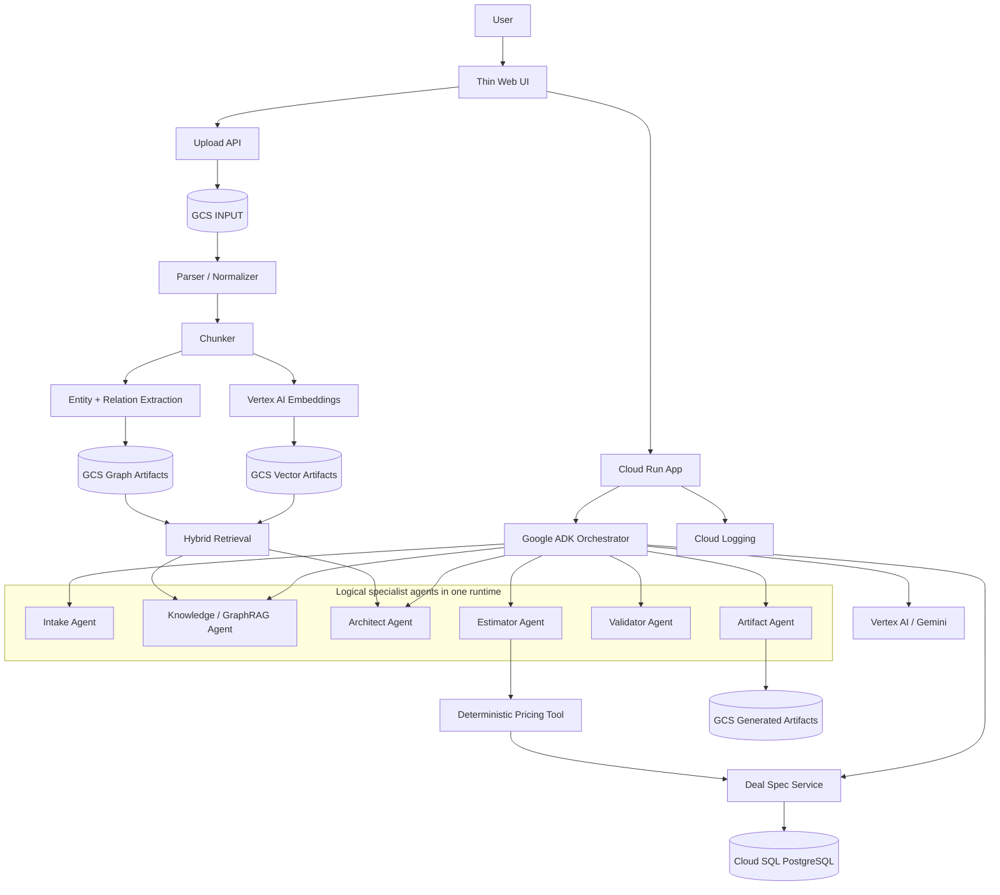
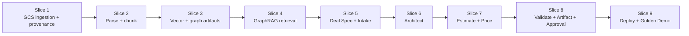
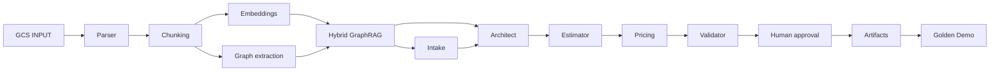
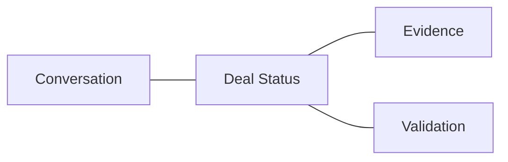

# Implementation Plan — FAST DEMO in 10 business days at 50% allocation

Status: APPROVED BASELINE  
Mode: FAST DEMO / PA-SDD  
Target cloud: Google Cloud Platform  
Duration cap: **10 business days**  
Primary implementation allocation: **50%**  
Planning assumption: **4 productive hours/day over 10 business days = 40 implementation hours = 5 effective person-days**

## 1. Objective

Build a working FAST DEMO of Solution Deal Agent that proves the Golden Deal end-to-end without exceeding 10 business days at 50% allocation.

The demo must prove the business experience, traceability and governed knowledge flow. It must not attempt to implement the final enterprise platform.

The implementation follows DevPattern / PA-SDD principles:

- minimum sufficient specification;
- simple feature slices first;
- explicit agent/tool contracts;
- executable evidence;
- architecture proportional to risk and maturity;
- no production-only complexity unless required to demonstrate the use case.

## 2. Capacity model and scope discipline

### Capacity

```text
10 business days
× 4 productive hours/day
= 40 implementation hours
= 5 effective person-days
```

This is a hard planning constraint.

### Rule

If a feature threatens the 40-hour cap, reduce demo depth before adding infrastructure complexity.

### Must prove

1. Golden RFP uploaded to GCS INPUT.
2. Parsing and chunking with provenance.
3. Minimum architecture corpus ingested through the same GCS INPUT path.
4. Embeddings and lightweight vector retrieval.
5. Lightweight graph extraction and relationship-aware retrieval.
6. Hybrid GraphRAG evidence packet.
7. Intake Agent extracts requirements and unresolved questions.
8. Architect Agent proposes an evidenced technical solution.
9. Estimator creates structured WBS / roles / hours.
10. Deterministic pricing tool calculates demo cost / price / margin.
11. Validator catches seeded defects.
12. Human approval transitions the deal to PROPOSAL_READY.
13. One technical proposal artifact and one pricing summary are generated from the same Deal Spec version.

### Explicitly deferred

- production SSO;
- private networking / PSC / complex VPC design;
- enterprise CRM or ERP integrations;
- dedicated graph database;
- managed enterprise vector database;
- distributed multi-agent deployment;
- event-driven orchestration;
- full document-format coverage;
- production-grade security/compliance controls;
- multi-environment promotion flow;
- complete AgentOps platform;
- automatic proposal delivery to clients.

## 3. Demo architecture for the 10-day implementation



### Architectural simplifications for FAST DEMO

- One Cloud Run deployable application.
- Logical multi-agent orchestration inside one ADK runtime.
- GCS used for source documents and derived vector/graph artifacts.
- Cloud SQL used only for canonical structured deal state and approval state.
- Vector and graph stores remain replaceable adapters.
- No graph database is introduced during this 10-day window.

## 4. Implementation slices



## 5. 10-day plan

| Day | Allocation | Focus | Key work | End-of-day evidence |
|---|---:|---|---|---|
| **D1** | 4h | Bootstrap + cloud foundation | Project structure, config, Cloud Run skeleton, GCS buckets/zones, service account, Secret Manager placeholders, health endpoint, local run | App starts; health check passes; GCS INPUT exists |
| **D2** | 4h | Upload + parser + provenance | Upload API, persist to GCS INPUT, object metadata, parser/normalizer for demo Markdown/PDF-compatible abstraction, provenance record | Golden RFP stored in GCS and normalized with source identity |
| **D3** | 4h | Chunking | Structural/semantic chunking, chunk metadata, hashes, source section/page reference, chunk manifest, ingest architecture corpus | RFP + corpus produce reproducible chunks with provenance |
| **D4** | 4h | Vector + graph construction | Vertex AI embeddings, lightweight vector artifact persisted in GCS, entity/relation extraction, graph artifact persisted in GCS | Searchable vector and graph artifacts exist for Golden Deal/corpus |
| **D5** | 4h | Hybrid GraphRAG retrieval | Metadata filtering, vector similarity, graph expansion, fusion/reranking, evidence packet with citations | Golden evaluation queries return expected architecture evidence |
| **D6** | 4h | Deal Spec + Intake Agent | Cloud SQL schema or minimal state model, Deal Spec service, Intake Agent, requirement extraction, known/unknown/assumed, clarification questions | Golden RFP produces structured Deal Spec + expected gaps |
| **D7** | 4h | Architect Agent | Architect contract, GraphRAG tool, architecture reasoning, alternatives/trade-offs, ADR-like decisions, evidence references | Golden Deal produces traceable architecture proposal without inventing missing critical facts |
| **D8** | 4h | Estimation + deterministic pricing | WBS schema, roles/hours, estimation rationale, fixed demo rate card/rules, pricing calculator, calculation snapshot | Structured effort + reproducible cost/price/margin output |
| **D9** | 4h | Validator + artifact + approval | Seeded defect detection, proposal-readiness gate, approval record, technical proposal and pricing summary generation | Validator blocks seeded defects; approved Deal Spec creates two consistent artifacts |
| **D10** | 4h | Integration + deploy + evidence | Cloud Run deployment, smoke tests, Golden Deal end-to-end run, minimal UX polish, evidence pack, demo script, bug-fix reserve | Working deployed demo + repeatable Golden Deal demo evidence |

Total planned capacity: **40 hours**.

## 6. Daily operating rhythm

At 50% allocation, avoid context switching. Recommended daily cadence:

```text
15 min  — review prior evidence / blocker
3 h 15  — implementation of the current slice
15 min  — test / eval
15 min  — commit, evidence and next-day checkpoint
```

Each day must end with something executable or inspectable, not only documentation.

## 7. Critical path



Anything not on this chain is secondary during the 10-day FAST DEMO.

## 8. Definition of Done by capability

### GCS ingestion

Done when:
- upload first writes the source to GCS INPUT;
- a stable source identifier and GCS URI are recorded;
- downstream processing reads the object from GCS, not from browser-local bytes;
- reprocessing is possible from the persisted source.

### Chunking

Done when every chunk contains at least:

```yaml
chunk_id: string
source_id: string
gcs_uri: string
gcs_generation: string
source_type: rfp | architecture | precedent
section: string
sequence: integer
text_hash: string
chunker_version: string
text: string
```

### GraphRAG

Done when:
- vector retrieval returns semantically relevant chunks;
- graph expansion contributes relationship context;
- an evidence packet includes source references;
- Golden Deal retrieval tests return expected corpus assets.

### Intake

Done when the Golden RFP yields:
- structured requirements;
- category;
- source reference;
- confirmed/assumed/unknown status;
- seeded ambiguity questions.

### Architect

Done when:
- architecture decisions cite requirements and corpus evidence;
- unresolved critical unknowns remain explicit;
- at least one alternative/trade-off is produced where material.

### Estimate and pricing

Done when:
- WBS and effort are structured;
- material assumptions are visible;
- pricing output is reproduced from deterministic inputs;
- LLM does not calculate or override the authoritative price.

### Validator

Done when it detects the three Golden Deal seeded inconsistencies:
- duration mismatch;
- unsupported architecture decision;
- pricing role not present in WBS.

### Approval and artifacts

Done when:
- PROPOSAL_READY requires an explicit approval record;
- technical proposal and pricing summary reference the same Deal Spec version;
- no artifact silently changes scope, duration or price.

## 9. Minimal demo UI

The demo UI should optimize demonstration value rather than completeness.

Recommended single-page layout:



Must show:
- conversational interaction;
- upload RFP;
- current lifecycle state;
- outstanding clarifications;
- architecture result;
- effort and pricing summary;
- cited evidence;
- validation findings;
- approve button;
- generated artifact links.

Avoid spending implementation time on a full design system during FAST DEMO.

## 10. Evaluation plan

### Golden retrieval evals

At minimum validate queries such as:

1. What security/IAM principles apply to a platform with PII?
2. What pattern is applicable for batch ingestion?
3. What pattern is applicable for low-latency ingestion?
4. What guidance applies to hybrid/private connectivity?
5. What governance and data-quality controls are required?
6. What CI/CD and IaC principles apply?

Expected evidence IDs are defined by the minimum architecture corpus.

### Agent evals

- Intake extraction completeness.
- Correct unresolved-question detection.
- Architecture evidence coverage.
- No unsupported authoritative claims.
- Pricing regression test.
- Validator seeded-defect detection.
- Cross-artifact consistency.

## 11. Demo script target

The final demonstration should fit in 10–12 minutes:

```text
1 min  Product context + Golden RFP
1 min  Upload → GCS INPUT
1 min  Requirements + gaps
2 min  GraphRAG evidence + architecture decision
1 min  WBS / effort
1 min  pricing calculation
1 min  validator catches seeded problem
1 min  human approval
1 min  generated proposal / pricing artifact
1–2 min  traceability + closing value message
```

## 12. Risks and controls

| Risk | Impact | Control |
|---|---|---|
| PDF parsing consumes too much time | High | Author Golden fixture in Markdown and keep parser behind an adapter; add PDF only if time permits |
| GraphRAG becomes over-engineered | High | GCS-backed lightweight vector/graph artifacts; no graph DB during FAST DEMO |
| Too many agents | High | One ADK runtime; logical specialists only |
| UI consumes schedule | Medium | Thin demo UI; prioritize evidence and lifecycle visibility |
| Cloud SQL provisioning delays | Medium | Adapter allows temporary local/SQLite development, but deployed target remains Cloud SQL for canonical state |
| Model output variability | Medium | Structured schemas, deterministic tools, Golden eval prompts and fixed demo corpus |
| Artifact generation complexity | Medium | Generate Markdown/HTML first; document conversion is secondary |
| Pricing ambiguity | High | Fixed synthetic demo rate card and deterministic formula |

## 13. Scope-cut order if schedule slips

Cut in this order without breaking the core demo:

1. visual polish;
2. extra artifact formats;
3. PDF-specific parser refinements;
4. advanced graph traversal depth;
5. multiple architecture alternatives;
6. additional precedent cases.

Do **not** cut:

- GCS INPUT before chunking;
- provenance;
- evidence citations;
- deterministic pricing;
- validator gate;
- human approval;
- canonical Deal Spec.

## 14. Demo completion gate

The demo is complete only when the Golden Deal can run end-to-end through this path:

```text
Golden RFP
→ GCS INPUT
→ Parse / Normalize
→ Chunk + Provenance
→ Embeddings + Vector Artifact
→ Entity/Relation Graph Artifact
→ Hybrid GraphRAG Evidence
→ Intake / Deal Spec
→ Architecture Decisions
→ WBS / Effort
→ Deterministic Pricing
→ Validation
→ Human Approval
→ Technical Proposal + Pricing Summary
```

and the run produces an evidence pack sufficient to demonstrate that critical outputs are traceable to source requirements, governed architecture knowledge and deterministic commercial rules.

## 15. Success target after 10 business days

At the end of D10, the team should have a **credible FAST DEMO**, not a production system.

The demo should prove one business proposition clearly:

> A qualified opportunity or RFP can be converted into a traceable, architecture-grounded, commercially consistent proposal package through a governed agentic workflow in materially less time than the current manual process.
