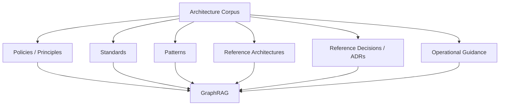
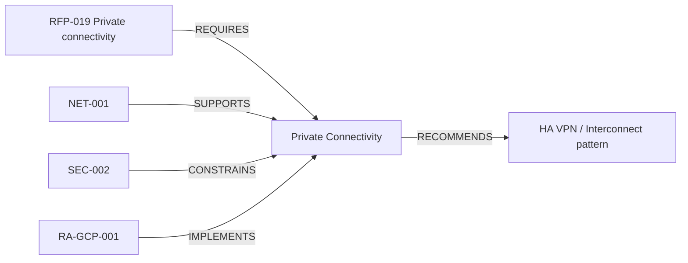
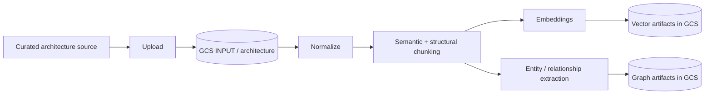
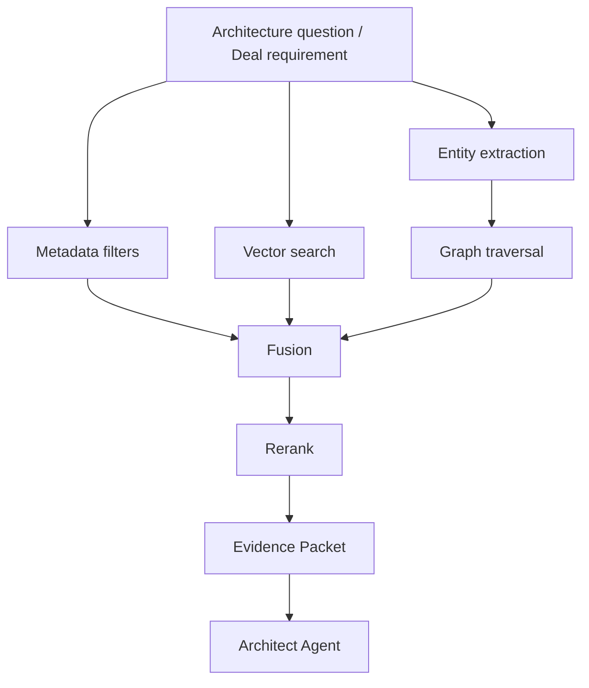

# SPEC-002 — Minimum Architecture Corpus

Status: BASELINE  
Purpose: minimum governed knowledge required for the Golden Deal  
Target retrieval: hybrid metadata + vector + graph / GraphRAG

## 1. Objective

The minimum architecture corpus is the smallest curated set of architecture knowledge that allows the Architect Agent to make evidence-backed decisions for the Golden Deal.

It is intentionally small enough for FAST DEMO but structured as if it were an enterprise knowledge product: every asset has identity, ownership, version, lifecycle status, domain, applicability and relationships.

The corpus is not a random folder of PDFs. It is a governed set of reusable architecture assets that can be chunked, embedded, represented as graph entities and cited by agents.

## 2. Knowledge classes



The Golden Deal also uses historical proposal precedents, but those remain a separate knowledge domain and must not be treated as approved architecture policy.

## 3. Minimum corpus size

Baseline: **18 architecture assets**.

This is enough to exercise multiple evidence types and relationships without creating an artificial enterprise repository.

| ID | Type | Domain | Title / intent |
|---|---|---|---|
| ARCH-PR-001 | Principle | General | Prefer managed services unless a clear requirement justifies custom infrastructure. |
| ARCH-PR-002 | Principle | General | Separate authoritative business state from conversational memory. |
| DATA-PR-001 | Principle | Data | Preserve lineage and source provenance through ingestion and transformation. |
| SEC-PR-001 | Principle | Security | Apply least privilege and explicit workload identities. |
| NET-001 | Standard | Network | Private/hybrid connectivity for enterprise source databases. |
| SEC-001 | Standard | Security | Encryption in transit and at rest for sensitive data. |
| SEC-002 | Standard | Security | No direct public exposure of protected source databases. |
| IAM-001 | Standard | IAM | Role-based access and service-account separation. |
| DATA-001 | Standard | Data | Data classification, ownership and retention metadata requirements. |
| GOV-001 | Standard | Governance | Catalog and lineage required for governed analytical datasets. |
| OBS-001 | Standard | Operations | Central logging, monitoring, alerting and operational ownership. |
| DEV-001 | Standard | DevSecOps | CI/CD and Infrastructure as Code required across environments. |
| PAT-ING-001 | Pattern | Data ingestion | Batch ingestion pattern for database/files/API sources. |
| PAT-ING-002 | Pattern | Data ingestion | Near-real-time ingestion pattern for low-latency sources. |
| PAT-DATA-001 | Pattern | Data platform | Landing / raw / curated / serving data organization pattern. |
| PAT-DQ-001 | Pattern | Data quality | Data-quality controls and quarantine/reprocessing pattern. |
| RA-GCP-001 | Reference Architecture | GCP | Governed analytics platform on GCP. |
| RA-DEVOPS-001 | Reference Architecture | DevSecOps | Multi-environment CI/CD + IaC delivery architecture. |

## 4. Required metadata schema

Every architecture asset must carry at least:

```yaml
asset_id: string
title: string
asset_type: principle | policy | standard | pattern | reference_architecture | adr | guidance
domain: string
summary: string
owner_role: string
version: string
status: CURRENT | REVIEW_REQUIRED | DEPRECATED | REPLACED
evidence_level: OFFICIAL | PROVEN | EXPERIMENTAL
effective_date: date
review_date: date | null
cloud_scope: [GCP | AZURE | AWS | CLOUD_AGNOSTIC]
technology_scope: []
applicability_tags: []
requirements_supported: []
related_assets: []
supersedes: []
source_uri: string
confidentiality: DEMO_PUBLIC | INTERNAL | RESTRICTED
```

For FAST DEMO, `source_uri` identifies the object in GCS after ingestion. The repository file is only the authoring source.

## 5. Minimum content template

Each asset should contain:

1. intent;
2. scope / when it applies;
3. decision or guidance;
4. rationale;
5. mandatory controls if applicable;
6. exceptions / when not to use;
7. implementation notes;
8. relationships to other assets;
9. source/version metadata.

Example:

```markdown
# NET-001 — Private connectivity for enterprise sources

## Intent
Avoid exposing protected enterprise databases directly to the public internet.

## Applies when
- source database is on-premises or in a protected network;
- workload contains sensitive or regulated data.

## Guidance
Use approved private/hybrid connectivity and explicit routing/firewall controls.

## Related assets
- SEC-002
- IAM-001
- RA-GCP-001
```

## 6. Graph model

The graph must represent concepts, not only document-to-document links.

### Minimum node types

```text
ArchitectureAsset
Principle
Standard
Pattern
ReferenceArchitecture
Technology
Capability
RequirementType
Control
Domain
CloudPlatform
```

### Minimum edge types

```text
APPLIES_TO
REQUIRES
SUPPORTS
IMPLEMENTS
CONSTRAINS
RELATED_TO
DEPENDS_ON
RECOMMENDS
SUPERSEDES
VALID_FOR
```

### Example



The graph should enable retrieval such as: “Which approved assets support the control implied by this requirement?”

## 7. Chunking strategy for architecture assets

Architecture corpus ingestion follows the same mandatory source rule:



### Chunk boundaries

Prefer semantic/structural boundaries:

- document heading;
- policy statement;
- applicability section;
- control/rule;
- rationale;
- exception;
- reference-architecture component description.

Avoid arbitrary fixed-size splitting as the only strategy.

Target baseline:

- 300–800 tokens per chunk when practical;
- small overlap only where semantic continuity needs it;
- never merge unrelated controls into one chunk;
- preserve heading hierarchy.

### Chunk metadata

```yaml
chunk_id: string
asset_id: string
asset_version: string
gcs_uri: string
gcs_generation: string
content_hash: string
section_path: string
chunk_index: integer
chunker_version: string
created_at: datetime
domain: string
asset_type: string
status: string
applicability_tags: []
```

## 8. Vector retrieval requirements

The vector layer must support semantic similarity across:

- requirement text;
- architecture questions;
- patterns;
- controls;
- reference-architecture descriptions.

Minimum retrieval filters:

- `status=CURRENT` by default;
- domain;
- cloud scope;
- asset type;
- applicability tags;
- evidence level when useful.

Deprecated/replaced material must not rank as authoritative evidence unless specifically requested for historical analysis.

## 9. GraphRAG retrieval flow



Evidence Packet minimum structure:

```yaml
query_id: string
question: string
requirements: []
vector_hits: []
graph_paths: []
selected_evidence:
  - asset_id: string
    chunk_id: string
    relevance: float
    rationale: string
source_uris: []
```

## 10. Golden Deal coverage matrix

The minimum corpus must cover these decision themes:

| Decision theme | Minimum supporting assets |
|---|---|
| GCP managed architecture | ARCH-PR-001, RA-GCP-001 |
| Source provenance / lineage | DATA-PR-001, GOV-001 |
| Batch ingestion | PAT-ING-001, RA-GCP-001 |
| Near-real-time ingestion | PAT-ING-002, RA-GCP-001 |
| Data zones / serving | PAT-DATA-001, RA-GCP-001 |
| PII/security | SEC-001, SEC-PR-001, IAM-001 |
| Private connectivity | NET-001, SEC-002 |
| CI/CD + IaC | DEV-001, RA-DEVOPS-001 |
| Observability | OBS-001 |
| Governance/catalog/lineage | DATA-001, GOV-001 |
| Data quality | PAT-DQ-001 |
| Environment separation | DEV-001, IAM-001, RA-DEVOPS-001 |

If a Golden Deal material decision cannot be supported by at least one approved corpus asset, the gap must be visible rather than filled by generic model knowledge.

## 11. Minimum precedent corpus — separate domain

Although this specification is about architecture knowledge, the Golden Deal also needs a small historical evidence set for estimation and comparison.

Minimum: **5 synthetic precedents**.

| ID | Scenario | Key differentiator |
|---|---|---|
| PREC-001 | GCP data modernization, 25 sources / 70 pipelines | smaller migration baseline |
| PREC-002 | Hybrid bank analytics platform | private connectivity + PII |
| PREC-003 | 150-pipeline cloud migration | migration factory / effort scaling |
| PREC-004 | Batch + streaming analytics | mixed ingestion patterns |
| PREC-005 | Governed data platform | catalog, lineage and governance effort |

Precedents must be explicitly tagged `knowledge_domain=precedent` and never surfaced as architecture policy.

## 12. Suggested GCS layout

```text
gs://<bucket>/
├── input/
│   ├── opportunities/<deal_id>/
│   ├── architecture/
│   │   ├── principles/
│   │   ├── standards/
│   │   ├── patterns/
│   │   └── reference-architectures/
│   └── precedents/
├── normalized/
├── chunks/
├── embeddings/
├── vector-index/
├── graph/
├── artifacts/
└── evidence/
```

The `input/` zone is immutable-by-process for ingestion lineage: updates create a new object generation/version rather than silently replacing provenance.

## 13. Corpus quality gates

An asset is eligible for authoritative retrieval only when:

- `asset_id` is unique;
- owner is present;
- version is present;
- status is known;
- source provenance exists;
- domain and type are classified;
- content passes parse/chunk checks;
- graph extraction does not create unresolved duplicate canonical entities above the configured threshold;
- retrieval evaluation has at least one expected query when the asset is critical to Golden Deal coverage.

## 14. Retrieval eval set

Minimum 12 questions:

1. What policy prevents public exposure of source databases?
2. What assets apply to PII encryption?
3. Which pattern supports daily batch ingestion?
4. Which pattern applies to sub-5-minute ingestion?
5. Which reference architecture combines governed ingestion and BigQuery analytics?
6. Which standard requires CI/CD and IaC?
7. Which controls support least privilege?
8. Which assets support catalog and lineage?
9. What guidance applies to central monitoring?
10. Which pattern addresses data-quality quarantine/reprocessing?
11. Which assets support environment separation?
12. Which approved evidence applies to hybrid connectivity for the Golden Deal?

Each query must have expected asset IDs, allowing Recall@K / evidence-grounding evaluation.

## 15. Definition of Done for the minimum corpus

The minimum corpus is ready for construction when:

1. all 18 assets exist as synthetic governed content;
2. all are uploaded to GCS `input/architecture/` before processing;
3. normalization and chunking preserve provenance;
4. embeddings and graph artifacts are generated;
5. the 12-query retrieval eval suite passes the agreed baseline;
6. the Architect Agent can cite selected chunks/graph paths;
7. corpus gaps are reported explicitly.
