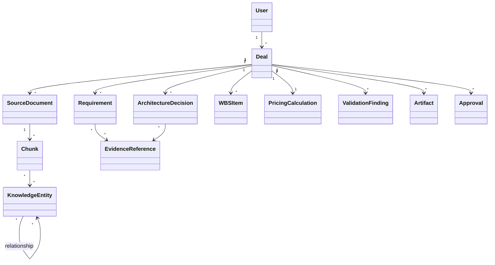
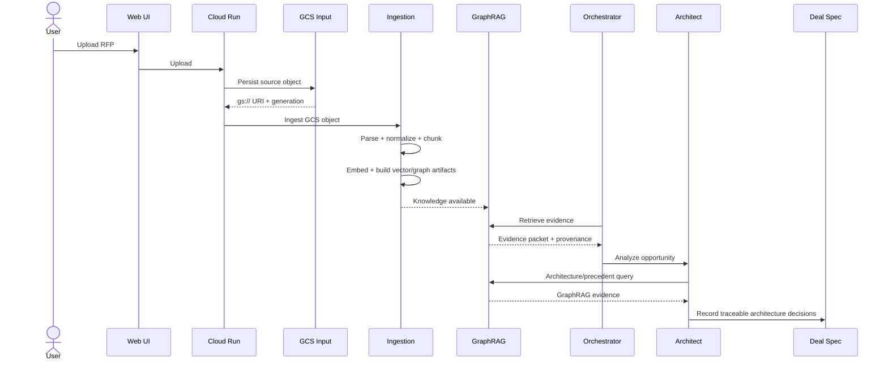

# SPEC-001 — Solution Deal Agent Construction Baseline

Status: READY FOR IMPLEMENTATION BASELINE  
Mode: FAST DEMO  
Method: PA-SDD / Minimum Sufficient Specification  
Cloud: Google Cloud Platform

## 1. Business intent

Pre-sales and solution-design work is fragmented across people, RFPs, proposal documents, architecture standards, spreadsheets and manually generated artifacts. Solution Deal Agent demonstrates an agentic workflow that converts an opportunity into a structured and traceable Deal Spec, retrieves governed knowledge through GraphRAG, proposes a technical solution, estimates effort, applies deterministic pricing, validates consistency and generates proposal artifacts with human approval.

## 2. North Star

**Median time from qualified opportunity to validated proposal-ready package.**

Guardrails:
- critical-source traceability;
- architecture-decision traceability;
- estimate transparency;
- commercial consistency;
- human approval;
- retrieval groundedness.

## 3. Personas

- **P-001 Sales / Pre-sales:** initiates and progresses an opportunity.
- **P-002 Solution / Data / Software / Cloud Architect:** reviews technical decisions and curated knowledge.
- **P-003 DevOps / DevSecOps Architect:** contributes engineering/security standards.
- **P-004 Commercial / Pricing Specialist:** reviews effort inputs and pricing rules.
- **P-005 Proposal Reviewer / Approver:** validates completeness and consistency.
- **P-006 Knowledge Curator:** publishes governed policies, patterns, reference architectures and precedents.

## 4. User stories

### Opportunity and RFP

**US-001 — Conversational opportunity**  
As a pre-sales user, I want to describe an opportunity conversationally so that the system structures the context and asks only for material missing information.

**US-002 — Upload RFP**  
As a pre-sales user, I want to upload an RFP so that it is first stored in the controlled GCS input zone and then processed into traceable requirements.

**US-003 — Inspect extracted requirements**  
As an architect, I want to see each extracted requirement with its source locator, confidence/status and classification so that I can verify what the client actually requested.

**US-004 — Clarification loop**  
As a pre-sales user, I want the platform to identify unknown, ambiguous or contradictory requirements and ask clarification questions so that missing information is not invented.

### Knowledge and GraphRAG

**US-005 — Curate architecture knowledge**  
As a knowledge curator, I want to place approved architecture policies, patterns and reference material into a controlled GCS input area so that the ingestion pipeline can version, chunk, index and graph them.

**US-006 — Find precedents**  
As an architect, I want to retrieve similar historical proposals and lessons learned using semantic similarity plus graph relationships so that prior evidence can accelerate a new solution.

**US-007 — Trace retrieved evidence**  
As a reviewer, I want every retrieved evidence item to retain document, chunk and relationship provenance so that recommendations can be audited.

### Architecture

**US-008 — Generate traceable architecture proposal**  
As an architect, I want the Architect Agent to combine current requirements, governed architecture knowledge and historical precedents so that it can propose a solution with explicit rationale and references.

**US-009 — Compare alternatives**  
As an architect, I want material design alternatives and trade-offs to be compared so that the final decision is not presented as an unexplained single answer.

**US-010 — Stop on critical unknowns**  
As an architect, I want the agent to stop and ask for missing critical information when a design decision cannot responsibly be closed.

### Estimation and pricing

**US-011 — Build WBS and effort estimate**  
As a solution team member, I want the approved architecture to produce a structured WBS with roles, hours/FTE, dependencies and estimation rationale.

**US-012 — Calculate deterministic economics**  
As a pricing specialist, I want the estimate to be converted into cost, price and margin using versioned business rules so that the result is reproducible.

### Validation and artifacts

**US-013 — Validate proposal readiness**  
As a reviewer, I want an independent validator to detect unresolved requirements, unsupported architecture decisions and inconsistencies across scope, WBS and pricing.

**US-014 — Generate proposal artifacts**  
As a proposal user, I want technical/economic artifacts generated from the same approved Deal Spec version so that values remain consistent.

**US-015 — Human approval**  
As an accountable approver, I want to approve, reject or accept exceptions before a deal becomes proposal-ready.

## 5. Functional requirements

### Intake / source documents

**FR-001** The system shall create a deal from a conversational input.

**FR-002** The system shall accept supported document uploads through the application UI/API.

**FR-003** Every uploaded source shall be persisted to the configured **GCS input zone before any parsing or chunking begins**.

**FR-004** The system shall record `gcs_uri`, object generation/version, document ID, upload timestamp and source classification.

**FR-005** The ingestion service shall process documents only from an approved GCS input URI/prefix.

**FR-006** The parser shall normalize supported document content while preserving source locators such as section/page/paragraph where possible.

**FR-007** The Intake Agent shall extract and classify candidate requirements.

**FR-008** Extracted requirements shall retain source evidence and distinguish `CONFIRMED`, `ASSUMED`, `UNKNOWN` and `DERIVED` states.

**FR-009** The system shall generate clarification questions for material gaps, ambiguity or contradictions.

### Chunking and ingestion

**FR-010** The system shall implement structure-aware semantic chunking over normalized documents read from GCS input.

**FR-011** Chunking shall preserve section boundaries and identifiers where available.

**FR-012** Each chunk shall persist provenance including source GCS object/version, document ID, locator, knowledge domain, chunker version and content hash.

**FR-013** Chunk size and overlap shall be configurable rather than hard-coded.

**FR-014** Re-processing the same unchanged source with the same chunker version shall produce reproducible chunk identities or equivalent deterministic evidence.

**FR-015** Chunk artifacts shall be persisted before embeddings/index generation.

### Embeddings / vector retrieval

**FR-016** The system shall generate embeddings for eligible chunks using a configured embedding model.

**FR-017** Embedding/index artifacts for FAST DEMO shall be persisted in GCS through the Vector Store adapter.

**FR-018** The system shall support metadata-filtered vector similarity retrieval by knowledge domain.

### Knowledge graph / GraphRAG

**FR-019** The ingestion pipeline shall extract configured entity and relationship types from eligible chunks.

**FR-020** Graph nodes and edges shall retain references to supporting chunks/source evidence.

**FR-021** Graph artifacts for FAST DEMO shall be persisted in GCS through the Graph Store adapter.

**FR-022** GraphRAG retrieval shall combine vector candidate retrieval and bounded graph traversal.

**FR-023** Retrieval shall rerank evidence using relevance and at least source authority/status metadata.

**FR-024** Retrieval results shall return evidence packets containing source document, chunk IDs and graph relationships used.

**FR-025** Architecture knowledge and historical precedents shall remain separately filterable knowledge domains.

### Deal Spec

**FR-026** The system shall maintain one canonical, versioned Deal Spec per opportunity.

**FR-027** Specialist outputs shall update the Deal Spec through explicit application services/tools.

**FR-028** Deal Spec mutations shall record actor/agent, timestamp, changed fields and reason/evidence where applicable.

### Architect Agent

**FR-029** The Architect Agent shall consume current requirements, governed architecture knowledge and relevant precedents as distinguishable evidence classes.

**FR-030** The Architect Agent shall ask for clarification if a configured critical unknown prevents a material decision.

**FR-031** The Architect Agent shall produce a proposed solution, assumptions, alternatives where material, trade-offs and cited evidence.

**FR-032** Material architecture decisions shall be stored as structured ADR-like records linked to requirements and evidence.

### Estimation

**FR-033** The Estimator Agent shall generate a WBS linked to the selected architecture/components.

**FR-034** The estimate shall contain roles, hours/FTE, duration assumptions, dependencies and uncertainty/range where appropriate.

**FR-035** Material effort values shall identify their basis: precedent, estimation rule, expert assumption or combination.

### Pricing

**FR-036** Pricing shall be computed through a deterministic Pricing Service/tool.

**FR-037** Pricing inputs shall include structured effort plus configured rate card/business-unit variables.

**FR-038** The pricing result shall persist input snapshot, rule/rate-card version, cost, price and margin.

**FR-039** An LLM shall not override the authoritative deterministic pricing result.

### Validation / approval / artifacts

**FR-040** The Validator Agent shall evaluate requirement completeness, source traceability, architecture evidence, estimate basis, pricing integrity and cross-section consistency.

**FR-041** Blocking findings shall prevent clean transition to `PROPOSAL_READY` unless a human explicitly accepts the exception.

**FR-042** Artifact generation shall use one explicit Deal Spec version.

**FR-043** The system shall generate at least one technical proposal artifact and one economic/pricing summary for the demo.

**FR-044** The system shall support human `APPROVE`, `REJECT` and `APPROVE_WITH_EXCEPTION` decisions.

**FR-045** The approval record shall persist actor, timestamp, Deal Spec version and accepted exceptions.

### Observability / evidence

**FR-046** The system shall log correlation/deal ID, invoked agent/tool and operation outcome.

**FR-047** Knowledge operations shall log source GCS URI/version, chunker version, retrieval evidence IDs and GraphRAG relationships used where applicable.

**FR-048** Agent outputs shall record model/instruction version sufficient for demo reproducibility/evaluation.

## 6. Non-functional requirements

**NFR-001 — Traceability**  
Material requirements, architecture decisions, retrieved precedents and generated claims must be traceable to evidence.

**NFR-002 — Determinism for commercial calculation**  
Given identical pricing inputs and rule versions, pricing outputs must be identical.

**NFR-003 — Replaceability**  
Vector, graph, LLM, persistence and parser technologies shall be isolated sufficiently to allow adapter replacement without rewriting core use cases.

**NFR-004 — Security / least privilege**  
Runtime service accounts shall have only the minimum required GCP permissions.

**NFR-005 — Data ingress control**  
Chunking/ingestion shall reject source references outside the configured GCS input location.

**NFR-006 — Confidentiality**  
Raw document bodies shall not be unnecessarily emitted into application logs.

**NFR-007 — Auditability**  
Deal lifecycle transitions and human approvals shall be recorded.

**NFR-008 — Maintainability**  
The codebase shall follow feature-oriented Hexagonal Slice boundaries from DevPattern.

**NFR-009 — Testability**  
Core business rules and retrieval orchestration shall be testable without live external services through replaceable adapters/fakes where practical.

**NFR-010 — Observability**  
The demo shall expose structured logs for ingestion, retrieval, agent/tool calls and validation outcomes.

**NFR-011 — Performance target**  
For the controlled demo corpus, a normal conversational/retrieval response should target an interactive experience; exact SLO is measured during FAST DEMO rather than prematurely fixed.

**NFR-012 — Cost discipline**  
The FAST DEMO shall prefer serverless/scale-to-zero managed components and avoid always-on infrastructure unless evidence justifies it.

**NFR-013 — Provenance durability**  
A chunk/evidence reference shall retain enough identity to resolve the exact source object generation used during ingestion.

**NFR-014 — Accessibility/usability baseline**  
The main UI shall expose system status, uncertainty, citations/evidence and approval actions clearly, following the DevPattern usability baseline.

## 7. Business rules

**BR-001** Missing critical information must be surfaced; it must not be silently invented.

**BR-002** Historical price/effort are evidence, not authoritative current values.

**BR-003** Authoritative pricing is deterministic.

**BR-004** Architecture decisions must reference at least one current requirement and supporting governed evidence when available.

**BR-005** The only valid document input to chunking is an object stored in the configured GCS input zone.

**BR-006** Generated proposal artifacts may not silently change approved scope, duration or price.

**BR-007** A blocking validator finding prevents clean proposal-ready status unless accepted explicitly by a human.

**BR-008** Architecture policies with `draft/deprecated/expired` status cannot be treated as authoritative approved policy.

**BR-009** Graph traversal must be bounded to prevent uncontrolled context expansion.

**BR-010** Every GraphRAG answer packet must retain provenance; unsupported retrieval output is not considered evidence.

## 8. Logical data model

## 9. Main sequence

## 10. Acceptance criteria

### AC-001 — Controlled GCS ingestion
Given a supported file uploaded through the UI
When ingestion starts
Then the raw document exists in the configured GCS input path
And the ingestion request references that GCS object and generation
And parsing/chunking does not start from a local/browser path.

### AC-002 — Chunk provenance
Given a document in GCS input
When chunking completes
Then every chunk has a chunk ID, document ID, GCS source URI/version, locator, hash and chunker version
And the chunk can be traced back to its source.

### AC-003 — GraphRAG index construction
Given curated architecture and precedent documents in GCS input
When ingestion completes
Then vector artifacts are created
And graph nodes/edges are created
And graph/vector artifacts preserve references to supporting chunks.

### AC-004 — Hybrid retrieval
Given a query requiring both semantic similarity and a known relationship
When GraphRAG retrieval runs
Then vector candidates and graph candidates are considered
And the response evidence packet exposes the supporting chunks and relationships.

### AC-005 — RFP extraction
Given the Golden Deal RFP in GCS input
When the Intake Agent analyzes it
Then candidate requirements are extracted and classified
And source locators are retained
And intentionally missing/ambiguous critical information is surfaced as clarification questions.

### AC-006 — Architecture traceability
Given structured requirements and curated architecture knowledge
When architecture analysis runs
Then the system proposes a solution with assumptions/trade-offs
And every configured material decision references at least one requirement and evidence item
And a critical unknown causes a clarification rather than fabrication.

### AC-007 — Estimation
Given an approved architecture
When estimation runs
Then a structured WBS and role/hour estimate is produced
And material estimate lines expose their basis.

### AC-008 — Deterministic pricing
Given an approved structured estimate and rate-card/rule version
When pricing runs twice with identical inputs
Then cost, price and margin are identical
And the input/rule snapshot is inspectable.

### AC-009 — Validation gate
Given a Deal Spec with a seeded blocking inconsistency
When validation runs
Then the issue is detected
And clean transition to PROPOSAL_READY is prevented until resolved or accepted by a human.

### AC-010 — Artifact consistency
Given an approved Deal Spec version
When proposal artifacts are generated
Then the technical proposal and pricing summary use the same approved scope, duration and price values
And record the Deal Spec version used.

### AC-011 — Approval
Given no unresolved blocking finding or an explicitly accepted exception
When an authorized demo user approves the package
Then an Approval record is created
And the deal transitions to PROPOSAL_READY.

### AC-012 — Retrieval failure behavior
Given no sufficiently relevant evidence
When a specialist queries GraphRAG
Then the system returns insufficient evidence rather than fabricating a precedent or policy.

## 11. Initial evals

- requirement extraction against manually labeled Golden Deal RFP;
- source-locator/citation correctness;
- chunk provenance completeness;
- retrieval precision for architecture policies;
- GraphRAG relationship retrieval test;
- grounded architecture decision coverage;
- estimator schema completeness;
- deterministic pricing regression;
- validator seeded-inconsistency detection;
- artifact cross-consistency.

## 12. Construction sequence

```mermaid
flowchart LR
    S1[Sprint 1: foundation + GCS input] --> S2[Sprint 2: parser + chunking]
    S2 --> S3[Sprint 3: embeddings + vector retrieval]
    S3 --> S4[Sprint 4: graph extraction + GraphRAG]
    S4 --> S5[Sprint 5: Intake + Architect]
    S5 --> S6[Sprint 6: Estimator + Pricing]
    S6 --> S7[Sprint 7: Validator + Artifacts + approval]
    S7 --> DEMO[Golden Deal end-to-end evidence]
```

The implementation may compress these into fewer delivery iterations, but dependencies remain ordered.

## 13. Definition of Ready for construction

Construction may start when:

- this SPEC is accepted as baseline;
- architecture ports/adapters and GCP components are agreed;
- one Golden Deal RFP is selected;
- at least a minimal curated architecture corpus exists;
- at least 3 representative historical/mock precedents exist;
- a demo rate card/rule fixture exists;
- acceptance/eval fixtures are defined.

## 14. Explicit FAST DEMO exclusions

- production CRM/ERP integration;
- binding autonomous commercial commitments;
- automatic external sending of proposals;
- production legal approval;
- enterprise SSO/private network topology unless required by environment;
- full delivery actuals feedback;
- production-grade high-availability vector/graph database.

The FAST DEMO uses GCS-backed vector/graph artifacts through replaceable ports; a dedicated production vector/graph store is an evolution decision, not a hidden assumption.